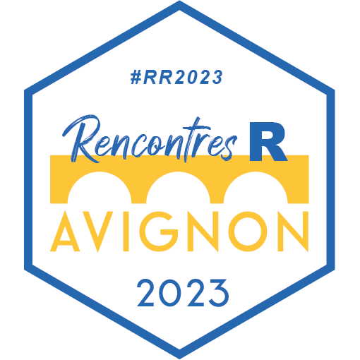

# tidymodels : créer un pipeline de machine learning complet avec {tidymodels} <a href="https://rr2023.sciencesconf.org"></a>


Dépôt du tutoriel donné aux [Rencontres R 2023 à Avignon](https://rr2023.sciencesconf.org)

> Tidymodels regroupe un ensemble de packages facilitant l’utilisation de méthodes d’apprentissage statistique (telles que les forêts aléatoires, modèles linéaires bayésien ou non...) dans un cadre unifié et “tidy”. Ce tutoriel vous montrera comment utiliser ces packages pour prétraiter les données, construire, entraîner et évaluer un modèle,  optimiser des hyperparamètres et tout ce que vous devez savoir pour mener de bout en bout un projet d’apprentissage statistique supervisé.


## Pré-requis

Pour profiter au maximum de ce tutoriel, merci de vérifier que vous avez une version de R >= 4.1 (disponible sur https://cran.r-project.org), une version récente de RStudio (https://www.rstudio.com/download) et d'installer au préalable les packages R que nous utiliserons à l'aide de la commande suivante :

``` r
install.packages(c("tidyverse", "tidymodels", 
                   "glmnet", "ranger", "xgboost", 
                   "finetune", "workflowsets", "corrr", "vip", 
                   "ggforce", "ggrain"))
```
